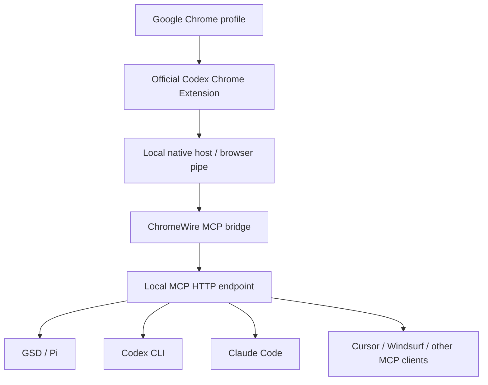

# ChromeWire MCP

ChromeWire MCP connects the official Codex Chrome Extension to MCP-compatible AI CLIs, giving agents safe localhost control of real Chrome tabs without exposing cookies, history, or profile secrets by default.

> Independent project. Not affiliated with OpenAI, Google, Chrome, or the official Codex Chrome Extension team.

## Easy install via your AI agent

Copy one of these prompts into your AI coding agent / CLI assistant. The agent should inspect this repository and follow the bundled install skill at [`skills/install-codex-chrome-mcp/SKILL.md`](skills/install-codex-chrome-mcp/SKILL.md).

### English prompt

```text
Look into this repository: https://github.com/bakhtiersizhaev/chromewire-mcp
Install ChromeWire MCP in my local AI CLI / agentic MCP setup. Add it as an MCP server for the CLI I am using. Follow the repository instructions and the agent install skill here: skills/install-codex-chrome-mcp/SKILL.md
First verify Node.js 20+, Google Chrome, and the official Codex Chrome Extension: https://chromewebstore.google.com/detail/hehggadaopoacecdllhhajmbjkdcmajg
If the extension page is unavailable in my region, tell me that a USA IP via VPN/proxy may be required. Keep the MCP endpoint bound to 127.0.0.1. Run npm test, npm run check, npm run doctor, npm run smoke, then show me the final MCP config.
```

### Русский промпт

```text
Посмотри этот репозиторий: https://github.com/bakhtiersizhaev/chromewire-mcp
Установи ChromeWire MCP в мой локальный AI CLI / agentic MCP setup. Добавь его как MCP server для CLI, которым я пользуюсь. Следуй инструкциям репозитория и agent install skill: skills/install-codex-chrome-mcp/SKILL.md
Сначала проверь Node.js 20+, Google Chrome и официальный Codex Chrome Extension: https://chromewebstore.google.com/detail/hehggadaopoacecdllhhajmbjkdcmajg
Если страница расширения недоступна в моём регионе, скажи, что может понадобиться USA IP через VPN/proxy. MCP endpoint должен оставаться на 127.0.0.1. Запусти npm test, npm run check, npm run doctor, npm run smoke, потом покажи финальный MCP config.
```

### 中文提示词

```text
请查看这个仓库：https://github.com/bakhtiersizhaev/chromewire-mcp
请把 ChromeWire MCP 安装到我的本地 AI CLI / agentic MCP 环境中，并把它添加为当前 CLI 使用的 MCP server。请按照仓库说明和这个 agent install skill 执行：skills/install-codex-chrome-mcp/SKILL.md
先检查 Node.js 20+、Google Chrome，以及官方 Codex Chrome Extension：https://chromewebstore.google.com/detail/hehggadaopoacecdllhhajmbjkdcmajg
如果该扩展页面在我的地区无法打开，请告诉我可能需要使用 USA IP / VPN / proxy。MCP endpoint 必须保持绑定到 127.0.0.1。请运行 npm test、npm run check、npm run doctor、npm run smoke，然后给我最终 MCP config。
```


## Official Codex Chrome Extension

Install the official Codex Chrome Extension first:

```text
https://chromewebstore.google.com/detail/hehggadaopoacecdllhhajmbjkdcmajg
```

Direct link: [https://chromewebstore.google.com/detail/hehggadaopoacecdllhhajmbjkdcmajg](https://chromewebstore.google.com/detail/hehggadaopoacecdllhhajmbjkdcmajg)

Availability note: the Chrome Web Store listing may be region-gated for some users. If the official extension page is unavailable in your region, you may need a USA IP via VPN/proxy before installing it. Use only legal, policy-compliant access methods for your location and account.

## Search keywords

ChromeWire MCP is also described as: codex chrome extension mcp, codex chrome mcp bridge, chromewire mcp, real chrome mcp server, chrome automation mcp, ai cli browser control, claude code chrome mcp, codex cli chrome extension, cursor mcp chrome browser, windsurf mcp chrome, gsd pi mcp chrome, browser-use mcp bridge.

## What it connects



## Current platform status

| Platform | Status | Notes |
|---|---:|---|
| Windows | Supported | Uses local `codex-browser-use*` named pipes exposed by the official extension/native host. |
| macOS | Planned | Adapter needs validation against the official extension native-host transport on macOS. |
| Linux / Ubuntu | Planned | Adapter needs validation against the official extension native-host transport on Linux. |

The package includes cross-platform configuration paths, but the browser transport implemented today is the Windows named-pipe adapter.

## Security model

- The server binds to `127.0.0.1` by default.
- Do **not** expose this MCP server to the public internet.
- The bridge does not expose cookies, passwords, browser history, or storage by default.
- Some tools can still open tabs, click buttons, type text, scroll pages, and read visible text from pages you explicitly target.
- Only use it on Chrome profiles and machines you own or are authorized to control.

Read [`docs/SECURITY.md`](docs/SECURITY.md) before using this with real accounts.

## Requirements

- Node.js 20+
- Google Chrome
- Official Codex Chrome Extension installed and enabled: https://chromewebstore.google.com/detail/hehggadaopoacecdllhhajmbjkdcmajg
- A working native-host connection from the extension
- Windows for the current working transport

## Manual install

```bash
git clone https://github.com/bakhtiersizhaev/chromewire-mcp.git
cd chromewire-mcp
npm install
npm test
npm run check
npm run doctor
npm run smoke
npm start
```

Default endpoint:

```text
http://127.0.0.1:8962/mcp
```

Override host/port:

```bash
CODEX_CHROME_MCP_HOST=127.0.0.1 CODEX_CHROME_MCP_PORT=8970 npm start
```

## MCP client config

```json
{
  "mcpServers": {
    "chromewire": {
      "type": "http",
      "url": "http://127.0.0.1:8962/mcp"
    }
  }
}
```

See [`examples/gsd.mcp.json`](examples/gsd.mcp.json).

## Chrome profile selection

Profiles are discovered from the local Chrome user data directory. No profile names or IDs are hardcoded.

Useful tools:

- `codex_chrome_list_profiles`
- `codex_chrome_set_profile`
- `codex_chrome_health`

Preferences are stored outside the repository by default:

```text
~/.codex-chrome-mcp/profile-preference.json
```

## Agent install flow

An AI agent can install this bridge by following [`skills/install-codex-chrome-mcp/SKILL.md`](skills/install-codex-chrome-mcp/SKILL.md).

## Attribution and forks

This project uses Apache-2.0 plus a `NOTICE` file. Forks, redistributions, packages, and derivative works must preserve attribution to the original project in `NOTICE` and in the project README or equivalent documentation.

## Short descriptions

See [`docs/DESCRIPTIONS.md`](docs/DESCRIPTIONS.md) for English, Russian, and Chinese descriptions.

## Documentation

- [`docs/ARCHITECTURE.md`](docs/ARCHITECTURE.md)
- [`docs/SECURITY.md`](docs/SECURITY.md)
- [`docs/TROUBLESHOOTING.md`](docs/TROUBLESHOOTING.md)
- [`docs/README.ru.md`](docs/README.ru.md)
- [`docs/README.zh.md`](docs/README.zh.md)
- [`docs/DESCRIPTIONS.md`](docs/DESCRIPTIONS.md)
- [GitHub Pages site](https://bakhtiersizhaev.github.io/chromewire-mcp/)
