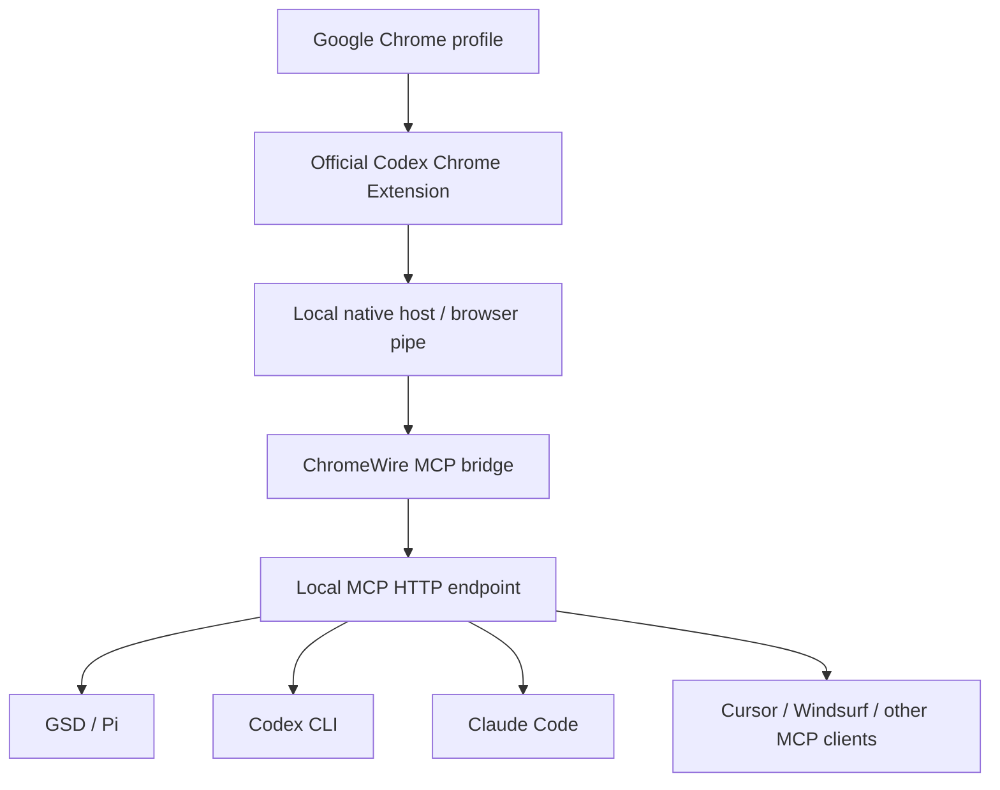

# ChromeWire MCP

ChromeWire MCP connects the official Codex Chrome Extension to MCP-compatible AI CLIs, giving agents safe localhost control of real Chrome tabs without exposing cookies, history, or profile secrets by default.

> Independent project. Not affiliated with OpenAI, Google, Chrome, or the official Codex Chrome Extension team.

## What it connects



## Current platform status

| Platform | Status | Notes |
|---|---:|---|
| Windows | Supported | Uses local `codex-browser-use*` named pipes exposed by the official extension/native host. |
| macOS | Planned | Adapter needs validation against the official extension native-host transport on macOS. |
| Linux / Ubuntu | Planned | Adapter needs validation against the official extension native-host transport on Linux. |

The package includes cross-platform configuration paths, but the browser transport implemented today is the Windows named-pipe adapter.

## Security model

- The server binds to `127.0.0.1` by default.
- Do **not** expose this MCP server to the public internet.
- The bridge does not expose cookies, passwords, browser history, or storage by default.
- Some tools can still open tabs, click buttons, type text, scroll pages, and read visible text from pages you explicitly target.
- Only use it on Chrome profiles and machines you own or are authorized to control.

Read [`docs/SECURITY.md`](docs/SECURITY.md) before using this with real accounts.

## Requirements

- Node.js 20+
- Google Chrome
- Official Codex Chrome Extension installed and enabled
- A working native-host connection from the extension
- Windows for the current working transport

## Manual install

```bash
git clone https://github.com/bakhtiersizhaev/chromewire-mcp.git
cd chromewire-mcp
npm install
npm test
npm run check
npm run doctor
npm run smoke
npm start
```

Default endpoint:

```text
http://127.0.0.1:8962/mcp
```

Override host/port:

```bash
CODEX_CHROME_MCP_HOST=127.0.0.1 CODEX_CHROME_MCP_PORT=8970 npm start
```

## MCP client config

```json
{
  "mcpServers": {
    "chromewire": {
      "type": "http",
      "url": "http://127.0.0.1:8962/mcp"
    }
  }
}
```

See [`examples/gsd.mcp.json`](examples/gsd.mcp.json).

## Chrome profile selection

Profiles are discovered from the local Chrome user data directory. No profile names or IDs are hardcoded.

Useful tools:

- `codex_chrome_list_profiles`
- `codex_chrome_set_profile`
- `codex_chrome_health`

Preferences are stored outside the repository by default:

```text
~/.codex-chrome-mcp/profile-preference.json
```

## Agent install flow

An AI agent can install this bridge by following [`skills/install-codex-chrome-mcp/SKILL.md`](skills/install-codex-chrome-mcp/SKILL.md).

## Attribution and forks

This project uses Apache-2.0 plus a `NOTICE` file. Forks, redistributions, packages, and derivative works must preserve attribution to the original project in `NOTICE` and in the project README or equivalent documentation.

## Short descriptions

See [`docs/DESCRIPTIONS.md`](docs/DESCRIPTIONS.md) for English, Russian, and Chinese descriptions.

## Documentation

- [`docs/ARCHITECTURE.md`](docs/ARCHITECTURE.md)
- [`docs/SECURITY.md`](docs/SECURITY.md)
- [`docs/TROUBLESHOOTING.md`](docs/TROUBLESHOOTING.md)
- [`docs/README.ru.md`](docs/README.ru.md)
- [`docs/README.zh.md`](docs/README.zh.md)
- [`docs/DESCRIPTIONS.md`](docs/DESCRIPTIONS.md)
