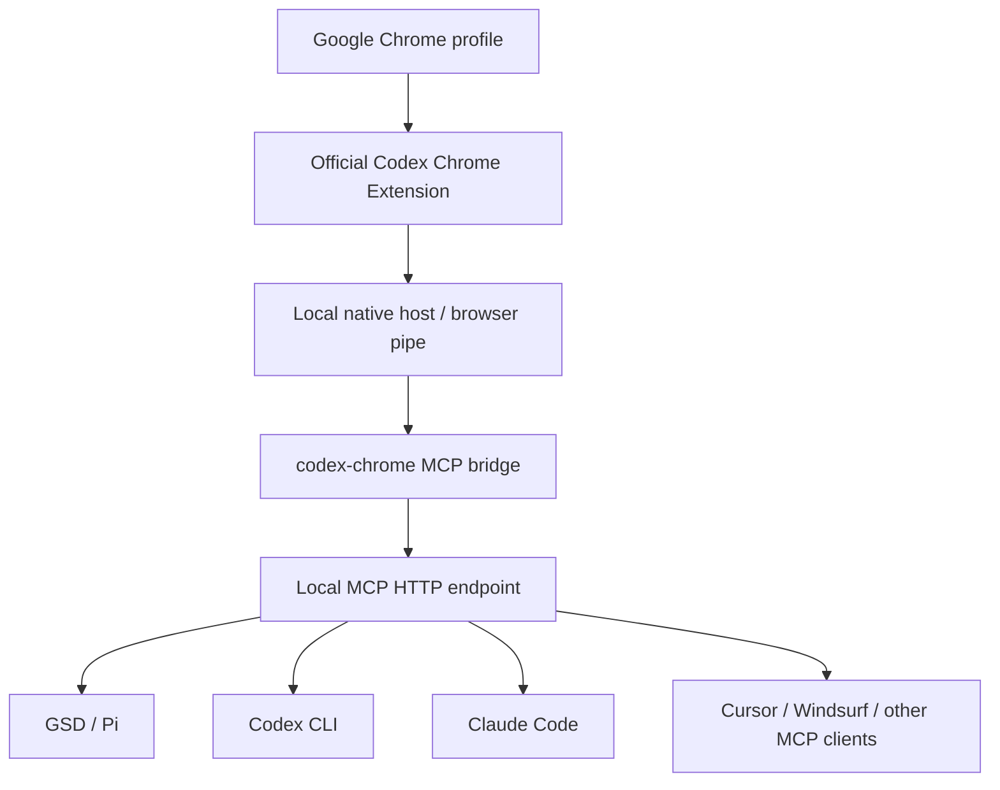
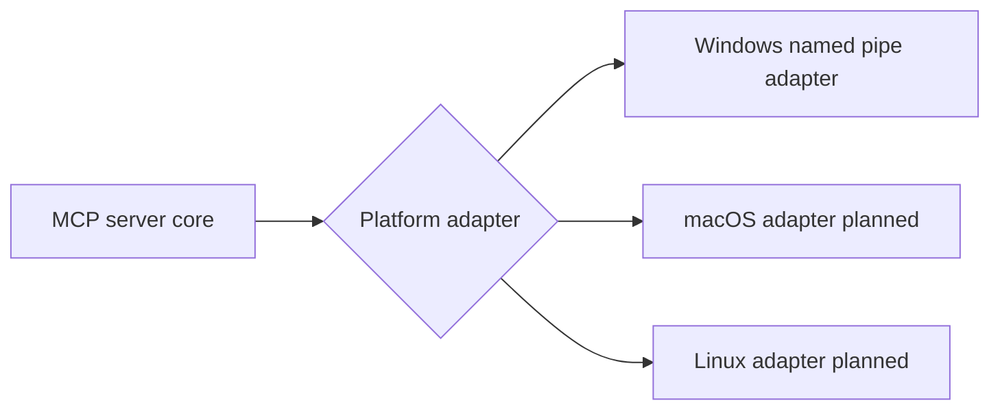

# Architecture

## Components

- `src/server.js` registers the HTTP MCP server and tool schemas.
- `src/config.js` owns portable paths, host, port, and dependency config.
- `src/codexChromePipe.js` speaks the extension/native-host JSON-RPC protocol over local browser pipes.
- `scripts/smoke.js` checks health, ping, and extension metadata.

## Platform adapters

Windows is the current working transport. macOS and Linux require validation against the official extension native-host transport on those platforms.
