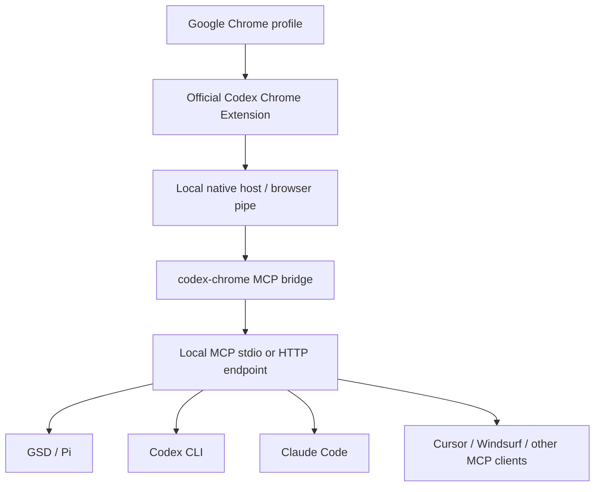
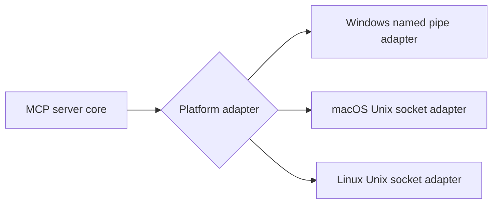

# Architecture

## Components

- `src/server.js` registers the MCP tool schemas and exposes the Streamable HTTP server.
- `src/stdio.js` exposes the same MCP tools over stdio for clients that launch local MCP subprocesses.
- `src/config.js` owns portable paths, host, port, and dependency config.
- `src/codexChromePipe.js` speaks the extension/native-host JSON-RPC protocol over local browser pipes.
- `src/nativeHostManifest.js` checks and installs native-host manifests; on Windows it also handles the Chrome native messaging registry key.
- `scripts/smoke.js` checks health, ping, and extension metadata.

## Platform adapters

Windows uses `codex-browser-use*` named pipes. macOS and Linux use Unix sockets, normally under `/tmp/codex-browser-use` unless `CODEX_CHROME_SOCKET_DIR` overrides it.

On macOS, Codex may reject socket peers that are not launched by Codex. For Codex CLI, use the stdio entrypoint with the Node.js runtime bundled in Codex.app.
